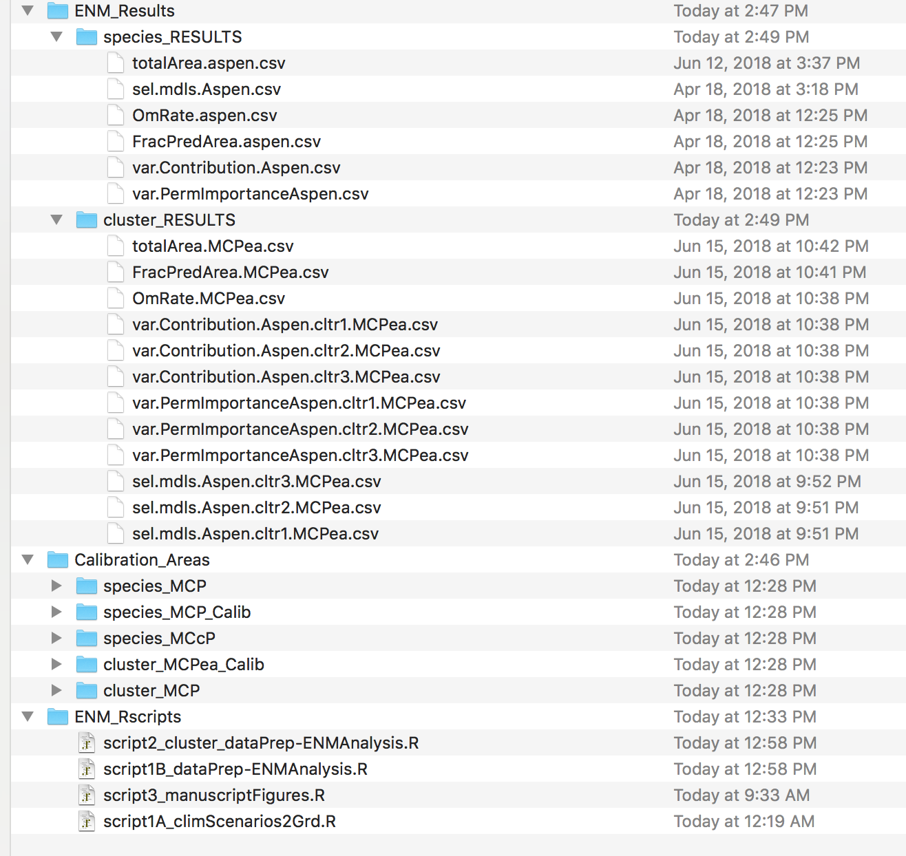
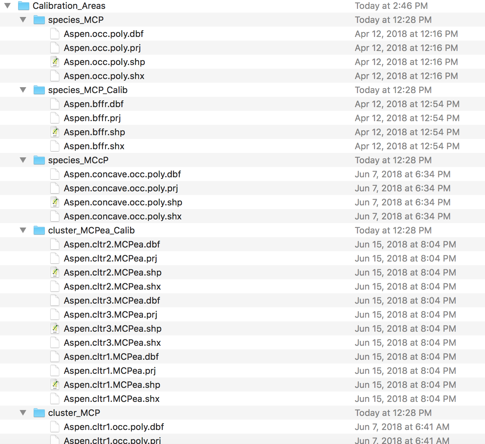

## README

## Data for: Genotyping-by-sequencing and ecological niche modeling illuminate phylogeography, admixture, and Pleistocene range dynamics in quaking aspen (_Populus tremuloides_)

**Justin C. Bagley** [:envelope:](mailto:jcbagley@vcu.edu)

_Department of Biology, Virginia Commonwealth University, Richmond, VA_
_Departamento de Zoologia, Universidade de Brasília, Brasília, DF, Brazil_

**Eliécer E. Gutiérrez**

_Universidade Federal de Santa Maria, Santa Maria, RS, Brazil_

**Neander M. Heming**

_Departamento de Zoologia, Universidade de Brasília, Brasília, DF, Brazil_


##

## LICENSE

All code and data within this "Data for: Genotyping-by-sequencing and ecological niche modeling 
illuminate phylogeography, admixture, and Pleistocene range dynamics in quaking aspen 
(_Populus tremuloides_)" Mendeley Data accession correspond to the paper by Bagley et al. (in 
review; see below) and is available "AS IS" under a generous 
<a href="https://creativecommons.org/licenses/by/4.0/">Creative Commons Attribution 4.0 
International licence</a> (or "CC BY 4.0"). See the online 
<a href="https://creativecommons.org/licenses/by/4.0/legalcode"></a> license for more
information.

## CITATION

If you use scripts from this accession as part of your published research, we request that 
you cite the dataset as follows (also see DOI information below): 
  
- Bagley, J.C., Gutiérrez, E.E., Heming, N.M. (2018). Data for: Genotyping-by-sequencing and 
ecological niche modeling illuminate phylogeography, admixture, and Pleistocene range dynamics 
in quaking aspen (_Populus tremuloides_). _Mendeley Data_, v1, available at:
<http://dx.doi.org/10.17632/jhkhvdgyfy.1>.

Alternatively, please provide the following link to this software/data accession in your 
manuscript:

- http://dx.doi.org/10.17632/jhkhvdgyfy.1

<!-- If you use code or data herein prior to the publication of our paper, then please also consider
citing our preprint:
Bagley, J. C., Gutiérrez, E. E., Heming, N. M., Cronn, R., Devisetty, U. K., Mock, K. E., Eckert, A. J., & Strauss, S. H. (2018). Genotyping-by-sequencing and ecological niche modeling illuminate phylogeography, admixture, and Pleistocene range dynamics in quaking aspen (_Populus tremuloides_). _PeerJ PrePrints_, XXXX.
-->

## DOI

The DOI for this accession is as follows: doi:[10.17632/jhkhvdgyfy.1](http://dx.doi.org/10.17632/jhkhvdgyfy.1). The CITATION section above illustrates how to cite this code using the DOI.

## INTRODUCTION

In support of the manuscript by Bagley et al. (in review) on quaking aspen phylogeography and ecological niche modeling (ENM), this accession dataset provides 1) code used to conduct two independent runs of the TASSEL-GBSv2 SNP discovery pipeline (Glaubitz et al. 2014) on our final (combined) genotyping-by-sequencing (GBS) dataset; 2) resulting SNP variant files from TASSEL-GBSv2 and final genotype data files used during our genomic analyses; and 3) species occurrence data files and computer code used during our ENM analyses of our focal taxon, Populus tremuloides. A list of the contents of this accession is given below in text format and is also visually depicted with figures showing the directory structure under [CONTENTS](#contents) below.

Users interested in GBS pipelines can see how we ran TASSEL-GBSv2, including changes to the default parameters and ways that calls to the Burrows-Wheeler alignment tool bwa (Li &  Durbin 2009) were incorporated into the workflow. Anyone with facility in population genetics and analysis of current population genomic data will be able to quickly use the final SNP dataset, e.g. to check SNPs or experiment with different filtering strategies, or use the genotype files to conduct population genetic analyses in ```R``` packages mentioned in the Materials and Methods section of the paper (Bagley et al. in review) or other software.

In this README, we list the files and analysis scripts contained within this accession, we briefly describe the genomic data files provided, and we briefly explain how ENM Rscripts herein were strung together in a pipeline workflow suitable for UNIX-like environments with recent R and MaxEnt installs.


## CONTENTS

**Scripts and other files contained in this accession.**

Text representation of the file tree structure of the accession:

```
Current directory tree structure:

/
|
|
|- ENM_Results
|   |-- species_RESULTS
|   |   |-- totalArea.aspen.csv
|   |   |-- sel.mdls.Aspen.csv
|   |   |-- OmRate.aspen.csv
|   |   |-- FracPredArea.aspen.csv
|   |   |-- var.Contribution.Aspen.csv
|   |   |-- var.PermImportanceAspen.csv
|   |   
|   |- cluster_RESULTS
|      |-- totalArea.MCPea.csv
|      |-- FracPredArea.MCPea.csv
|      |-- OmRate.MCPea.csv
|      |-- var.Contribution.Aspen.cltr1.MCPea.csv
|      |-- var.Contribution.Aspen.cltr2.MCPea.csv
|      |-- var.Contribution.Aspen.cltr3.MCPea.csv
|      |-- var.PermImportanceAspen.cltr1.MCPea.csv
|      |-- var.PermImportanceAspen.cltr2.MCPea.csv
|      |-- var.PermImportanceAspen.cltr3.MCPea.csv
|      |-- sel.mdls.Aspen.cltr3.MCPea.csv
|      |-- sel.mdls.Aspen.cltr2.MCPea.csv
|      |-- sel.mdls.Aspen.cltr1.MCPea.csv
|
|- Calibration_Areas
|   |-- species_MCP
|   |   |-- Aspen.occ.poly.dbf
|   |   |-- Aspen.occ.poly.prj
|   |   |-- Aspen.occ.poly.shp
|   |   |-- Aspen.occ.poly.shx
|   |
|   |- species_MCP_Calib
|   |   |-- Aspen.bffr.dbf
|   |   |-- Aspen.bffr.prj
|   |   |-- Aspen.bffr.shp
|   |   |-- Aspen.bffr.shx
|   |
|   |- species_MCcP
|   |   |-- Aspen.concave.occ.poly.dbf
|   |   |-- Aspen.concave.occ.poly.prj
|   |   |-- Aspen.concave.occ.poly.shp
|   |   |-- Aspen.concave.occ.poly.shx
|   |
|   |- cluster_MCPea_Calib
|   |   |-- Aspen.cltr2.MCPea.dbf
|   |   |-- Aspen.cltr2.MCPea.prj
|   |   |-- Aspen.cltr2.MCPea.shp
|   |   |-- Aspen.cltr2.MCPea.shx
|   |   |-- Aspen.cltr3.MCPea.dbf
|   |   |-- Aspen.cltr3.MCPea.prj
|   |   |-- Aspen.cltr3.MCPea.shp
|   |   |-- Aspen.cltr3.MCPea.shx
|   |   |-- Aspen.cltr1.MCPea.dbf
|   |   |-- Aspen.cltr1.MCPea.prj
|   |   |-- Aspen.cltr1.MCPea.shp
|   |   |-- Aspen.cltr1.MCPea.shx
|   |
|   |- cluster_MCP
|      |-- Aspen.cltr1.occ.poly.dbf
|      |-- Aspen.cltr1.occ.poly.prj
|      |-- Aspen.cltr1.occ.poly.shp
|      |-- Aspen.cltr1.occ.poly.shx
|      |-- Aspen.cltr2.occ.poly.dbf
|      |-- Aspen.cltr2.occ.poly.prj
|      |-- Aspen.cltr2.occ.poly.shp
|      |-- Aspen.cltr2.occ.poly.shx
|      |-- Aspen.cltr3.occ.poly.dbf
|      |-- Aspen.cltr3.occ.poly.prj
|      |-- Aspen.cltr3.occ.poly.shp
|      |-- Aspen.cltr3.occ.poly.shx
|   
|- ENM_Rscripts
      |-- script2_cluster_dataPrep-ENMAnalysis.R
      |-- script1B_dataPrep-ENMAnalysis.R
      |-- script3_manuscriptFigures.R
      |-- script1A_climScenarios2Grd.R
```

Graphical representations of the file tree structure:

Screenshot 1:

<!--  -->
<p align="left"></img></p>

Screenshot 2 - Calibration_Areas substructure: 

<!--  -->
<p align="left"></img></p>


## TASSEL-GBSv2 PIPELINE CODE

[In prep.]


## SNP VARIANT AND GENOTYPE FILE OVERVIEW

[In prep.]


## ENM PIPELINE OVERVIEW

[In prep.]


## ADDITIONAL NOTES

[In prep.]

## REFERENCES

- Bagley, J. C., Gutiérrez, E. E., Heming, N. M., Cronn, R., Devisetty, U. K., Mock, K. E., Eckert, A. J., & Strauss, S. H. (in review). Genotyping-by-sequencing and ecological niche modeling illuminate phylogeography, admixture, and Pleistocene range dynamics in quaking aspen (_Populus tremuloides_). _Molecular Ecology_.
- Goudet, J. (2005). Hierfstat, a package for R to compute and test hierarchical F-statistics. _Molecular Ecology Resources_, 5(1), 184–186.
- Jombart, T., & Ahmed, I. (2011). Adegenet 1.3-1: new tools for the analysis of genome-wide SNP data. _Bioinformatics_, 27, 3070–3071.
- Muscarella, R., Galante, P. J., Soley-Guardia, M., Boria, R. A., Kass, J. M., Uriarte, M., & Anderson, R. P. (2014). ENMeval: an R package for conducting spatially independent evaluations and estimating optimal model complexity for MAXENT ecological niche models. _Methods in Ecology and Evolution_, 5, 1198–1205.
- Li, H., & Durbin, R. (2009). Fast and accurate short read alignment with Burrows-Wheeler transform. _Bioinformatics_, 25(14), 1754–1760.


